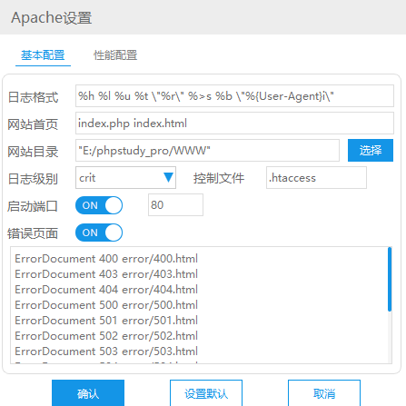
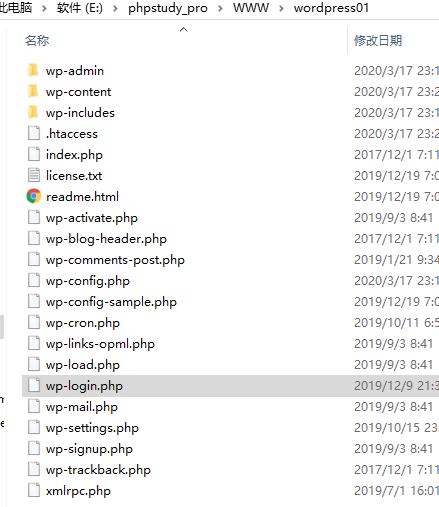

# WordPress


### phpstudy


* 安装目录中的WWW目录为网站根目录

* 访问方式为在浏览为输入

http://localhost/index.html

or

http://127.0.0.1/index.html

这是通过路径映射的方式制定了对应路径（apache服务）

直接输入localhost/由于没制定访问文件，会访问根目录的index.html（apache制定的默认首页文件）



可以看到设置的最高优先级文件是index.php

安装好phpMyAdmin

localhost/phpMyAdmin4.8.5打开网页服务端管理mysql数据库


### 安装wordpress

1. 将文件夹解压放入WWW文件夹，修改wordpress文件夹名

2. 访问初始化界面：

   localhost/wordpress01/index.php

3. 在phpMyAdmin界面创建数据库用于连接

4. 登录管理员后台：

   

5. 访问管理员后台路径：http://localhost/wordpress01/wp-login.php 或 http://localhost/wordpress01/wp-admin/

6. 前台地址：http://localhost/wordpress01/index.php


### 自定义主题

- 在content/theme文件内创建主题文件夹（后文件夹都指创建好的这个），并设置index.php。style.css(必须是这个名字)，其中注释内容中可设置主题的对应名称、作者等信息

- 文件夹中放入一张screenshot.png自动成为主题的预览封面

- 在index.php中进行php代码编写

  

  ```php
  <?php
  -   function myFirstFunction() {
        echo "<p>Hello, this is my first function</p>";
      }
  
      myFirstFunction();
  // 使用php的function方式如上，echo等于print
  ?>
  ```

  - 传入参数方法：

    ```php
      function greet($name,  $color) {
        echo "<p>Hi, my name is $name and my favorite color is $color.</p>";
      }
      greet('john','green');
      greet('jane','blue');
    ```

    > wordpress本身有很多种function可以直接调用

    

| 内置function            | 效果                                                         |
| ----------------------- | ------------------------------------------------------------ |
| bloginfo('name')        | 显示网站名                                                   |
| bloginfo('description') | 显示网站描述                                                 |
| have_posts()            | 循环条件（有post的情况下（指文章））have_posts函数被调用时实际上是调用全局变量`$wp_query->have_posts()`成员函数，来简单检查一个全局数组（array）变量`$posts`的一个循环计数器，以确认是否还有`post`，如果有返回`true（1）`，如果没有返回`false（0）`。 |
| the_post()              | the_post函数则调用`$wp_query->the_post()`成员函数前移循环计数器，并且创建一个全局变量`$post`(不是`$posts`)，把当前的`post`的所有信息都填进这个`$post`变量中，以备接下来使用。 |

- array

  ```php
  $names = array('Aragorn', 'John', 'James', 'Lisa');
  <p>Hi, my name is <?php echo $names[1];?>.</p>
  ```

  ```php
  $names = array('Aragorn', 'John', 'James', 'Lisa');
  // 循环方法显示名字
    $count = 0;
    while($count < count($names)) {
      echo "<li>Hi, my name is $names[$count]</li>";
      $count++;
    }
  ```

  

- 循环打印posts信息

  